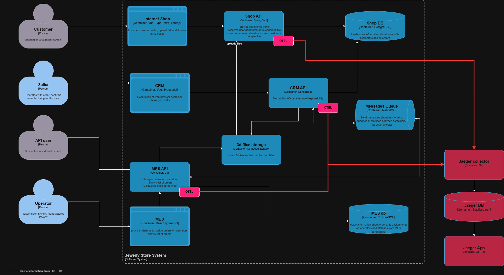
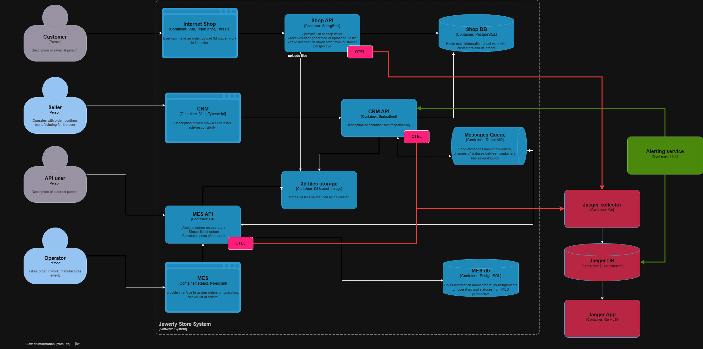

# Архитектурное решение по трейсингу

## 1. Анализ системы для трейсинга

### Ключевые точки, где заказ может «сломаться» или зависнуть

Трейсинг следует внедрять прежде всего на тех участках бизнес-процесса, где заказ проходит через несколько сервисов и где ошибки могут остаться незаметными для команды поддержки.

1. Shop API -> CRM API: создание заказа, передача данных о клиенте и статусе, запись в общую БД.
2. CRM API -> RabbitMQ: публикация событий о новом заказе, смене статуса или подтверждении производства.
3. RabbitMQ -> MES API: получение сообщения и запуск расчёта стоимости или перехода заказа в производственный процесс.
4. MES API -> CRM API: обратная передача статуса, результатов расчёта и завершения этапов производства.
5. CRM API -> MES API: подтверждение заказа в производство и дальнейшая работа с производственным процессом.
6. Дополнительно следует отслеживать переходы по статусам в Shop DB и MES DB, так как именно здесь часто теряется контекст заказа при асинхронной обработке.

### Компоненты, которые стоит покрыть трейсингом на C4-диаграмме

- Shop API
- CRM API
- MES API
- RabbitMQ
- Shop DB и MES DB
- Хранилище 3D-файлов, если заказ связан с загрузкой модели и расчётом стоимости

Фронтенд-компоненты, как правило, можно оставить вне первого этапа внедрения, так как основная проблема связана с межсервисным обменом и состоянием заказа в бэкенде.

### Данные для трейсинга

#### Обязательные поля в трейсе

1. Trace ID — глобальный идентификатор цепочки операций.
2. Span ID — идентификатор отдельной операции.
3. Parent Span ID — связь между родительской и дочерней операцией.
4. Timestamp — время начала и окончания операции.
5. Duration — длительность выполнения.
6. Service Name — название сервиса, где выполняется операция.
7. Operation Name — действие, например: create_order, calculate_price, publish_message, update_status.
8. Tags/labels:
   - order_id
   - user_id
   - channel (b2c / b2b)
   - status
   - model_complexity
   - partner_id
   - message_id
   - routing_key
9. Logs — структурированные логи с контекстом заказа.
10. Errors — флаги, тип ошибки и текст исключения.

#### Дополнительные данные, полезные для анализа

- Идентификатор смены и оператора в MES.
- Событие перехода по статусам заказа.
- Время ожидания в очереди RabbitMQ.
- Время выполнения SQL-запросов и медленные запросы к БД.

## 2. Мотивация

### Технические метрики, которые улучшатся

1. Снизится среднее время диагностики инцидентов с заказами.
2. Появится возможность измерять потерю сообщений в RabbitMQ и выявлять «зависшие» цепочки.
3. Станет прозрачным time-to-complete для полного жизненного цикла заказа.
4. Упростится анализ узких мест в расчёте стоимости и производственной обработке.

### Бизнес-метрики, которые улучшатся

1. Снизится доля заказов, которые выходят за SLA.
2. Уменьшится число жалоб клиентов и партнёров на «зависшие» заказы.
3. Повысится прозрачность процессов для поддержки и бизнеса.
4. Увеличится стабильность работы при росте нагрузки и новых рынках сбыта.

## 3. Предлагаемое решение

### Технологический стек

- OpenTelemetry — стандарт для инструментирования приложений.
- Jaeger — backend для хранения и визуализации трейсов.
- OpenSearch — долгосрочное хранение и поиск по трейсам.
- Prometheus + Alertmanager — метрики и алертинг по количественным показателям.
- Flink или лёгкий streaming-сервис — для анализа цепочек в реальном времени.

### Реализация по компонентам

1. Инструментирование приложений
   - Shop API и CRM API: Spring Boot + OpenTelemetry Java SDK или Spring Cloud Sleuth + OpenTelemetry exporter.
   - MES API: OpenTelemetry .NET SDK.
   - RabbitMQ: передача trace context через заголовки сообщений и добавление correlation ID в payload/headers.
   - Логирование: все логи должны содержать trace_id, span_id и order_id.

2. Инфраструктура наблюдаемости
   - На каждом сервисе развернуть OpenTelemetry SDK и exporter.
   - Jaeger Collector принимает трейсы, сохраняет их в OpenSearch и предоставляет UI для поиска и анализа.
   - Для доступа к UI использовать аутентификацию и разграничение прав.

3. Покрытие на уровне архитектуры
   - Внедрить трейсинг в ключевые точки бизнес-процесса: создание заказа, расчёт цены, публикацию/получение сообщений, обновление статуса заказа и завершение производства.
   - На C4-диаграмме выделить эти участки как зоны наблюдаемости и отразить, что трейс должен проходить через все сервисы и брокер сообщений.

### Автоматический мониторинг процесса прохождения заказа и алертинг

На основе данных трейсинга можно реализовать автоматический контроль состояния заказов.

#### Правила мониторинга

1. Зависшие заказы
   - Если статус заказа не меняется больше N часов, генерировать предупреждение.
2. Аномальная длительность этапов
   - Если p99 времени расчёта стоимости или перехода между статусами превышает SLA, создавать алерт.
3. Потерянные сообщения
   - Если сообщение опубликовано в RabbitMQ, но соответствующий span/событие в MES не получен, считать цепочку неполной.
4. Высокая доля ошибок в цепочке
   - Если в одном и том же сценарии более 5% цепочек завершаются ошибкой, инициировать алерт.

#### Действия по алертам

- При зависшем расчёте — перезапустить задачу в MES или перевести заказ на повторную обработку.
- При потере сообщения — повторно отправить событие из CRM или из сервиса-источника.
- При деградации цепочки — автоматически масштабировать сервис или увеличить число воркеров.
- Уведомления направлять в Slack, email или корпоративную систему инцидентов.

## 4. Компромиссы

1. Фронтенд-трейсинг не планируется на первом этапе.
   - Обоснование: основные проблемы связаны с межсервисными интеграциями, а не с UI.
   - Компромисс: сфокусироваться на бэкенд-сервисах и обмене сообщениями.

2. MES будет покрыт частично, а не полностью.
   - Обоснование: MES является проприетарной системой с ограниченными ресурсами на доработку.
   - Компромисс: инструментировать ключевые точки MES, прежде всего вход в расчёт стоимости и переходы по статусам.

3. Полноценный трейсинг БД не реализуется сразу.
   - Обоснование: это требует высокой сложности и не даёт мгновенной пользы.
   - Компромисс: использовать стандартные средства мониторинга БД для медленных запросов.

4. Интеграция с RabbitMQ будет упрощённой.
   - Обоснование: глубокое инструментирование брокера может быть сложным.
   - Компромисс: передавать trace context через заголовки сообщений без полной глубокой интеграции брокера.

## 5. Аспекты безопасности

1. Аутентификация
   - Доступ к Jaeger UI и API должен быть доступен только сотрудникам компании с актуальной учётной записью.
   - Для административного доступа использовать 2FA.

2. Авторизация (RBAC)
   - Операторы производства — доступ только к трейсам заказов в их смену, read-only.
   - Менеджеры CRM — доступ к трейсам всех заказов с возможностью поиска и фильтрации.
   - Разработчики — полный доступ к данным для отладки.
   - Администраторы — доступ к конфигурации и управлению пользователями.

3. Изоляция в защищённом контуре
   - Компоненты трейсинга размещать в изолированной сети и ограничить входящие соединения только доверенными IP-адресами.

4. Дополнительные меры защиты
   - Маскировать или удалять из трейсов персональные данные и чувствительную информацию.
   - Логировать запросы к API трейсинга с привязкой к пользователю.
   - Проводить регулярный аудит прав доступа и активных сессий.