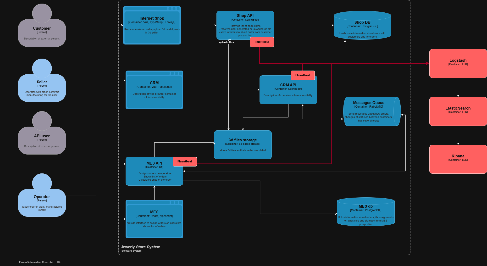

# Задание 4. Логирование

## Анализ системы и планирование логирования

### Какие логи необходимо собирать

#### Приоритетные системы

1. MES (C#) — основной узел бизнес-критичных операций: расчёт стоимости, изменение статусов, взятие заказа оператором.
2. CRM (Java Spring Boot) — управление жизненным циклом заказа и переходами между статусами.
3. RabbitMQ — критическая точка передачи сообщений, где возможны потеря, дублирование или задержка событий.
4. Онлайн-магазин — второй приоритет: создание заказа, загрузка 3D-файла и переходы статусов на этапе оформления.
5. Хранилище 3D-файлов — третий приоритет: логировать только метаданные файла и события доступа, но не содержимое файла.

С точки зрения бизнеса, первыми нужно настраивать логирование и трейсинг именно для MES, CRM и RabbitMQ, потому что именно там наблюдаются основные жалобы клиентов и операторов, а также риск потери заказов.

#### Общий формат логов

Все логи должны быть структурированными и записываться в JSON. В каждом сообщении должны присутствовать:

- timestamp
- service_name
- environment
- level
- trace_id
- span_id
- order_id
- event_type
- correlation_id

Пример структуры:

```json
{
  "timestamp": "2026-07-15T12:00:00Z",
  "service_name": "mes-api",
  "environment": "prod",
  "level": "INFO",
  "trace_id": "4d3f...",
  "span_id": "a1b2...",
  "order_id": "100512",
  "event_type": "order_status_changed",
  "old_status": "PRICE_CALCULATED",
  "new_status": "MANUFACTURING_APPROVED"
}
```

#### Обязательные бизнес-логи (уровень INFO)

| Событие | Поля |
| --- | --- |
| Создание заказа | order_id, customer_id, source (B2C/B2B), timestamp |
| Смена статуса заказа | order_id, customer_id, old_status, new_status, system, timestamp |
| Отправка сообщения в RabbitMQ | order_id, exchange, routing_key, message_id, timestamp |
| Получение сообщения из RabbitMQ | order_id, queue, message_id, timestamp |
| Начало расчёта стоимости | order_id, polygon_count, timestamp |
| Завершение расчёта стоимости | order_id, duration_ms, result, timestamp |
| Взятие заказа оператором | order_id, operator_id, timestamp |
| Загрузка 3D-файла | order_id, file_name, file_size_bytes, file_type, timestamp |
| Ошибка бизнес-процесса | order_id, error_code, description, timestamp |

#### Другие уровни логирования

- INFO — ключевые бизнес-события и переходы статусов.
- WARN — деградации и аномалии: долгий расчёт стоимости, повторная обработка сообщения, заметное отставание по очереди RabbitMQ.
- ERROR — ошибки бизнес-логики, падения интеграций, неуспешная отправка/получение сообщения.
- DEBUG — временно, только в dev/release окружениях; в проде не использовать или ограниченно включать по запросу.

## Мотивация внедрения логирования

### Бизнес-эффекты

- снижение количества потерянных и "зависших" заказов;
- сокращение времени ответа поддержки клиентам и партнёрам;
- снижение оттока B2B-партнёров из-за проблем с обработкой заказов;
- повышение прозрачности SLA производства и качества сервиса для клиентов.

### Технические метрики, на которые влияет решение

- MTTR (Mean Time To Recovery);
- количество инцидентов без установленной причины;
- процент заказов с "зависшим" статусом;
- среднее время расследования инцидента;
- число повторных обработок сообщений и количество ошибок интеграций.

## Предлагаемое архитектурное решение

### Выбор технологии

#### OpenSearch Stack

- OpenSearch — хранение и поиск логов;
- OpenSearch Dashboards — визуализация и анализ;
- Fluent Bit — агент сбора логов с EC2 и контейнеров;
- при необходимости — Alerting/Notifier для Slack, Email и Jira.

#### Причины выбора

- open-source лицензия;
- хорошая интеграция с Kubernetes и виртуальными машинами;
- поддержка JSON-логов и алертинга;
- возможность масштабирования по мере роста нагрузки.

### Архитектура логирования

1. Все сервисы пишут структурированные логи в stdout и/или локальный файл.
2. Fluent Bit собирает логи с EC2-инстансов и отправляет их в OpenSearch.
3. Для каждой системы создаётся отдельный индекс:
   - logs-mes-*
   - logs-crm-*
   - logs-shop-*
   - logs-rabbitmq-*
4. В логах обязательно сохраняются trace_id, span_id и order_id для корреляции с трассировкой.



### Связь логов с трейсингом

В каждый лог добавляются:

- Trace ID
- Span ID
- order_id

Это позволяет связывать события из логов и трасс и быстрее расследовать инциденты по одному заказу.

### Политика безопасности логов

Логи не должны содержать:

- персональные данные клиентов;
- платёжную информацию;
- содержимое 3D-файлов;
- любые чувствительные данные, которые не нужны для диагностики.

В логах допустимо хранить только метаданные: order_id, customer_id, file_name, file_size_bytes, file_type, status и технические идентификаторы.

Доступ:

- чтение логов — роли Support, DevOps, Backend;
- запись — только сервисные аккаунты;
- доступ через VPN / private network;
- аудит доступа к OpenSearch обязателен.

### Политика хранения логов

| Тип логов | Срок хранения | Причина |
| --- | --- | --- |
| INFO | 30 дней | Оперативный анализ и мониторинг |
| WARN | 60 дней | Анализ деградаций и аномалий |
| ERROR | 90 дней | Инциденты и разборы |

Ротация индексов — ежедневно. Старые индексы удаляются автоматически. Для каждой системы — отдельный индекс, а для разных окружений — отдельная группа индексов, например logs-mes-prod-* и logs-mes-release-*.

На старте целесообразно хранить логи в hot-слое в течение первых 7–14 дней, затем переносить часть данных в архивное хранилище при необходимости. Это снизит стоимость и сохранит доступность к последним событиям.

## Превращение логирования в систему анализа

### Алертинг

Нужно настроить алерты на:

- резкий рост ERROR по системе;
- отсутствие сообщений из RabbitMQ более N минут;
- аномальный рост создания заказов;
- расчёт стоимости, который превышает SLA (например, 30 минут);
- "зависшие" заказы, у которых статус не меняется длительное время.

Интеграция алертов:

- Slack / Email;
- тикет в Jira.

### Поиск аномалий

Использовать:

- rate-based алерты;
- пороговые значения;
- корреляцию по order_id;
- анализ распределения статусов по времени для выявления аномальных паттернов.