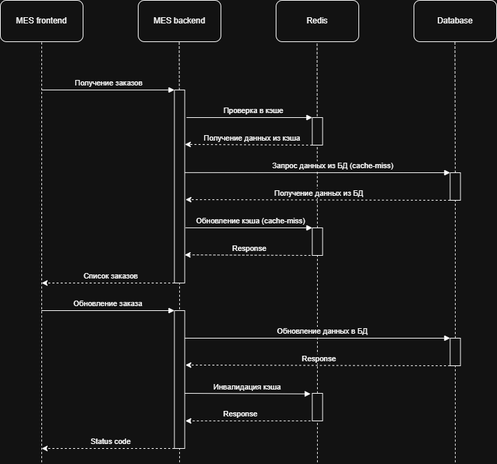

# Задание 5. Кеширование

## Анализ системы для кеширования

Анализ архитектуры показывает, что MES работает с большим объёмом заказов и постоянно обслуживает повторяющиеся операции чтения. На странице дашборда операторы регулярно запрашивают одни и те же списки заказов по статусам, а расчёт стоимости заказа в MES занимает длительное время и выполняется на стороне сервиса. В текущей архитектуре обращения к данным идут напрямую в базу данных, что создаёт узкое место при росте нагрузки.

Основные кандидаты на кеширование:
- список заказов для MES-дэшборда;
- самые новые заказы;
- справочные данные: статусы и параметры производства;
- результаты расчёта стоимости заказа по повторяющимся входным данным.

## Мотивация

Внедрение кеширования позволит:
- снизить нагрузку на MES DB;
- ускорить загрузку дашборда операторов;
- сократить время отклика для повторяющихся запросов;
- уменьшить время прохождения заказа, потому что повторный расчёт цены будет выполняться быстрее;
- снизить жалобы операторов и клиентов на задержки;
- подготовить систему к росту нагрузки и будущему масштабированию в Kubernetes.

## Предлагаемое решение

### Тип кеширования

Предлагается внедрить серверное кеширование, а не клиентское.

Почему серверное кеширование лучше:
- данные должны быть одинаково актуальны для всех операторов;
- статус заказа может измениться в любой момент;
- несколько пользователей работают с одними и теми же наборами заказов;
- серверный кеш проще контролировать с точки зрения инвалидации и консистентности.

### Технология кеша

Для этого подходит Redis:
- обеспечивает высокую скорость чтения;
- поддерживает TTL;
- хорошо интегрируется с C# и Kubernetes;
- подходит для сценариев с частыми чтениями и редкими изменениями.

### Паттерн кеширования

Выбран паттерн Cache-Aside.

Как он работает:
1. MES API получает запрос.
2. Сервис сначала пытается прочитать данные из Redis.
3. Если данные есть, они возвращаются из кеша.
4. Если данных нет, выполняется запрос к MES DB, после чего результат сохраняется в Redis.
5. При изменении данных кеш инвалидируется или обновляется.

Почему именно Cache-Aside:
- хорошо подходит для данных с частыми чтениями и редкими изменениями;
- не требует сложной перестройки существующей логики;
- даёт гибкую инвалидацию;
- удобно применять в сервисах, где чтение доминирует над записью.

Почему остальные паттерны хуже:
- Read-Through переносит логику загрузки в слой кеша и усложняет архитектуру;
- Refresh-Ahead создаёт лишнюю фоновую нагрузку и может прогревать данные раньше времени;
- Write-Through и Write-Behind увеличивают задержку записи и усложняют поддержку консистентности.

### Сущности, участвующие в процессе кеширования

В процессе кеширования участвуют:
- MES UI на React, который запрашивает данные для дашборда;
- MES API на C#, который управляет доступом к кешу и бизнес-логикой;
- Redis как слой кеширования;
- MES DB как источник правды для данных;
- RabbitMQ как канал событий об изменении статусов и новых заказах;
- при расчёте стоимости — входные данные, такие как 3D-модель и правила ценообразования.

### Процесс кеширования

1. Оператор открывает страницу MES.
2. MES API проверяет Redis по ключу, например orders:dashboard:{status}:{page}:{size}:{sort}.
3. Если запись есть, данные возвращаются из кеша.
4. Если записи нет, выполняется запрос к MES DB, а результат сохраняется в Redis.
5. При изменении статуса заказа, назначении оператора или смене этапа MES API и/или обработчик событий RabbitMQ удаляют или обновляют соответствующие ключи кеша.
6. Для расчёта стоимости по 3D-модели используется ключ вида price:calc:{modelHash}:{pricingVersion}; при повторном запросе результат берётся из кеша.

### Стратегия инвалидации кеша

Предлагается гибридная стратегия: программная инвалидация + TTL.

Почему такая стратегия подходит лучше всего:
- для списка заказов важна актуальность;
- для расчёта стоимости важно не хранить результат бесконечно;
- события в системе происходят часто, а TTL защищает от устаревания при пропуске обновлений.

Что будет служить триггерами инвалидации:
- создание нового заказа;
- изменение статуса заказа;
- начало или завершение этапа производства;
- изменение правил ценообразования;
- обновление 3D-модели.

Почему не подходят другие стратегии:
- только TTL недостаточен для MES-дэшборда, потому что операторы могут видеть слишком старые данные;
- только инвалидация по ключу сложна в поддержке и может пропустить часть данных;
- инвалидация по запросу слишком трудно формализовать и даёт много ложных срабатываний.

## Альтернативные решения

### Сравнение решений

| Критерий | Redis + Cache-Aside | Клиентское кеширование |
| --- | --- | --- |
| Консистентность | Высокая | Низкая |
| Конкуренция операторов | Контролируемая | Проблемная |
| Нагрузка на БД | Снижается | Не снижается |
| Масштабируемость | Высокая | Ограниченная |
| Сложность | Средняя | Низкая |

Серверное кеширование с использованием Redis и паттерна Cache-Aside является оптимальным решением для MES. Оно устраняет узкие места в чтении данных, снижает нагрузку на базу и при этом сохраняет достаточную актуальность критически важных данных.